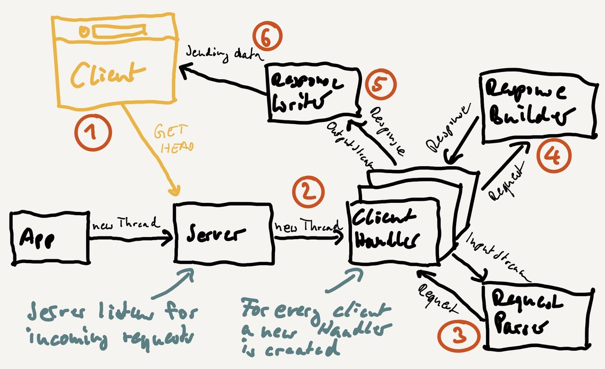

# Simple HTTP Webserver

The project runs a simple HTTP webserver to serve static files from a directory.

## Limited functionality

DEMO PROJECT - DO NOT USE IN PRODUCTION

Only GET and HEAD methods are supported at the moment.

## Project structure

All HTTP handling is done with pure Java and no external libraries. Spring is used to provide configuration (via application.properties, can be overridden via environment variables) and for Dependency Injection.

The blocking approach was chosen to deal with requests. In order to handle many requests, each client connection is processed in a new thread. If the connection is configured to 'keep-alive' (default in HTTP/1.1 if not explicitly set to 'close' by the client), further requests are processed in the same thread until the connection timeouts.

## Configuration

All project configuration in 'src/main/resources/application.properties' can be overridden via environment variables.

## Maven

To build and run the project locally, use `mvn clean install` and `java -jar target/java -jar target/webserver-0.0.1-SNAPSHOT.jar`. Java JDK 11 or higher required.

## Docker

To build the project, run from the project root:

`docker build -t lemberski/webserver .`

Now you can run your image:

`docker run -p 8080:8080 lemberski/webserver`

If you want to serve files from a local directory on your machine, say on '~/tmp/webserver_public', use the Docker run command

`docker run -p 8080:8080 -v ~/tmp/webserver_public:/local_www_root_dir -e www.root.dir=/local_www_root_dir lemberski/webserver`

## Loadtest

To run a simple load test, start the app (see 'Maven' and 'Docker' sections), then go to the loadtest directory and run

`npm install` (required only once)

`npm start`

Configuration options for load testing see 'loadtest/config.yml'. NodeJS is required to run 'npm'.
